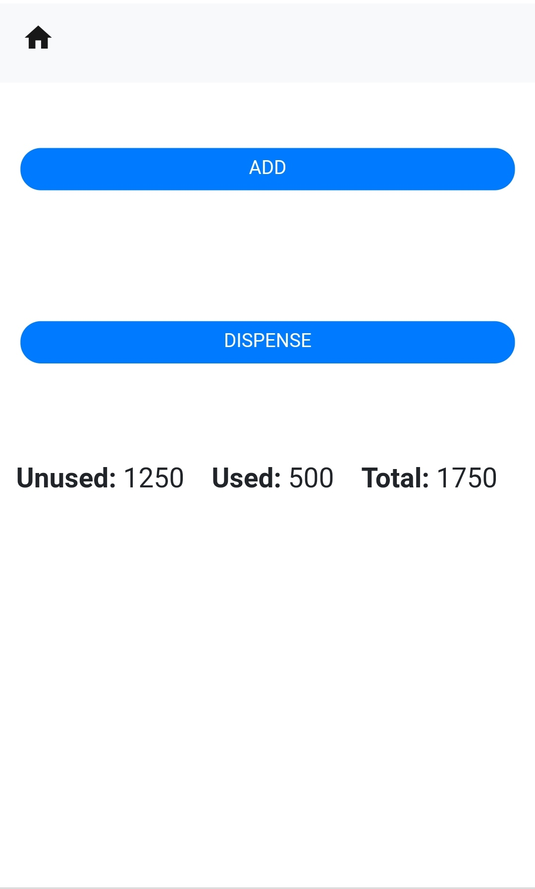
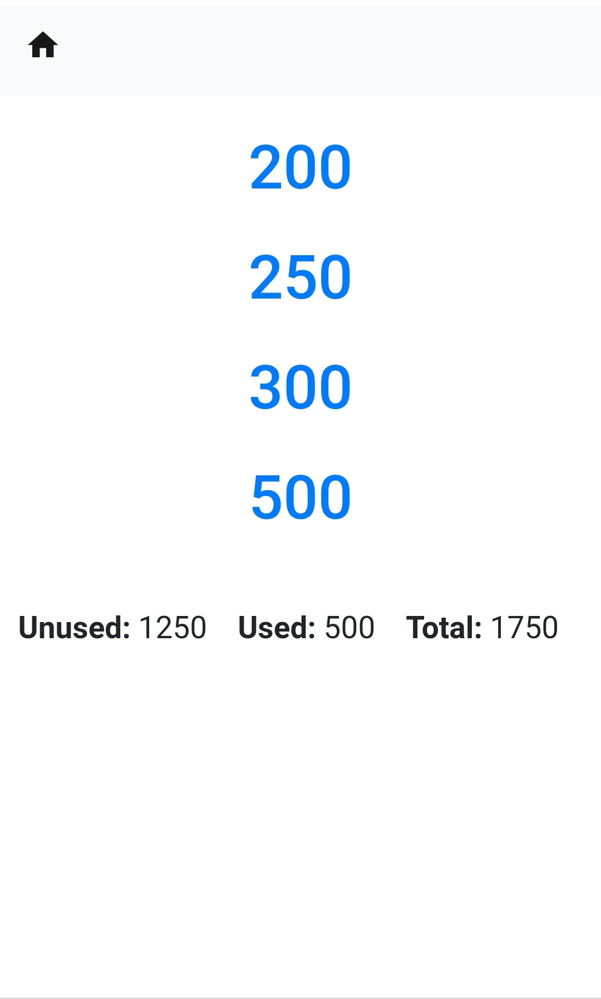
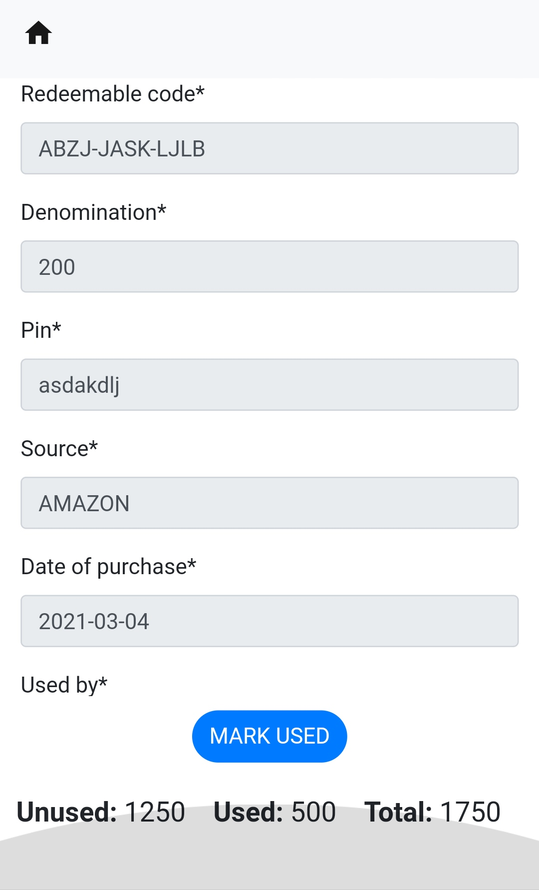
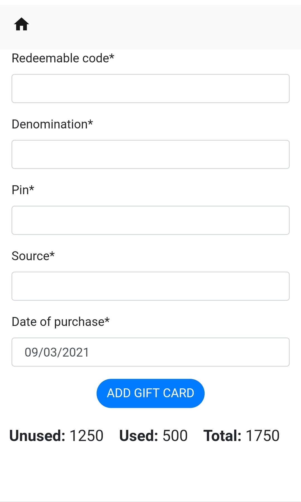

# GCManager  
A Gift Card Management System  
  
## Index  
* [What is this?](#what-is-this)  
* [Why is this needed?](#why-is-this-needed)  
* [What does this solve?](#what-does-it-solve) 
* [Who is this intended for?](#who-is-this-intended-for)  
* [Setup](#setup)
* [Image Gallery](#image-gallery)
* [Caveats](#caveats)
  
## What is this?  
This is a gift card management system, made to manage your gift cards in an hassle free way. Say goodbye to those pesky spreadsheets!  
  
## Why is this needed?  
I was having a really hard time managing my gift card collection in a spreadsheet, i always needed to fill in all the information by hand like the date of purchase, denomination, source etc and honestly it never felt intuitive to me and was becoming a lot of work that was hard to maintain.   
  
## What does it solve?  
It aims to automate the process of adding a gift card to your asset collection & retrieve them as and when needed.  
  
## Who is this intended for?  
GCManager can be used by anyone who believe that managing their gift cards is becoming a **PITA** and they wouldn't want to waste their time anymore.

## Setup
* Get the code
```bash
git clone https://github.com/vishaltanwar96/GCManager.git
```
* Add configuration
```bash
cd resources
mv sample.ini production.ini
```
Add following text into the production.ini file. Make sure you add the secret code that is not shared with anyone else
```bash
[DEFAULT]
SECRET_KEY = secret-only-you-know
DEBUG = False
```

* Create a virtual environment
```bash
cd ..
python3.<x-version-here> -m venv venv
```

Example:
```bash
python3.8 -m venv venv
```

* Install Requirements
```bash
pip install -r requirements.txt
``` 

* Run the application
```bash
gunicorn -w 1 -e ENV=production giftcardmanager.wsgi:application -b 0.0.0.0:8000 -D
```

* Open the Application\
Visit localhost:8000 or 127.0.0.1:8000 on your browser to use the application

* If you wish to stop the application, run this
```bash
lsof -ti :8000 | xargs kill -9
```

## Image Gallery









## Caveats
* This application was made keeping **AMAZON** brand in mind, but can be used for other brands that use **PIN** & **Redeem Code**.